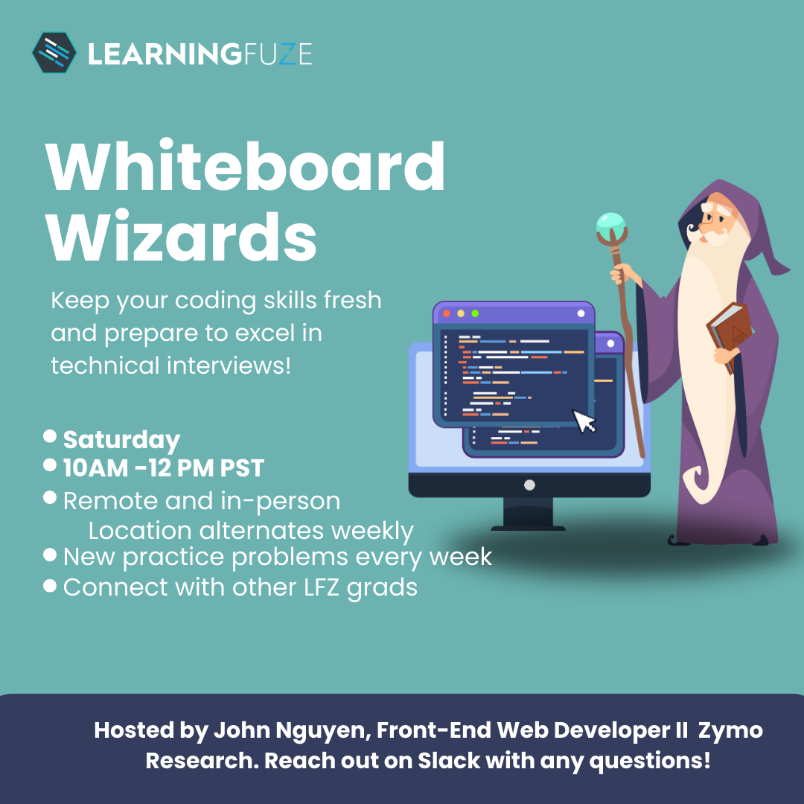

 

##### Assumption:

The job market is saturated, how do I stand out when everybody has learned the same tech stack as me?

 

##### My response:

Your approach to the code, how you overcome your challenges, and the way you work with others is uniquely your own.

 

##### The objective of this presentation:

I want to talk about my personal journey through my code. I hope sharing my perspective, especially as a someone who manages other junior web developers, can help you reframe this perspective.

 

> Developing your soft skills will make you stand out. LearningFuze is the perfect place to practice.

 

##### And I can help!

I'll be dedicating one hour each day to host 1:1 Alumni Mentorship sessions starting on Monday, January 15th.

[Click here to book an appointment!](https://calendly.com/jnguyen-lfz/1-1-alumni-mentorship)

 

 

I will also be hosting Whiteboard Wizards on Saturdays from 10:00AM to 12:00PM. This will be your opportunity to practice your live coding sessions as we practice Leetcode-style questions together. They will alternate between being remote and in-person at the LFZ building.

The first Whiteboard Wizards session will be <strong>remote</strong> on Zoom on Saturday, January 20th at 10:00AM.

The second Whiteboard Wizards session will be <strong>in person</strong> on Saturday, January 27th at 10:00AM.

Stay tuned for announcements in the slack channels.

 

 

##### Now, let me introduce myself next.
