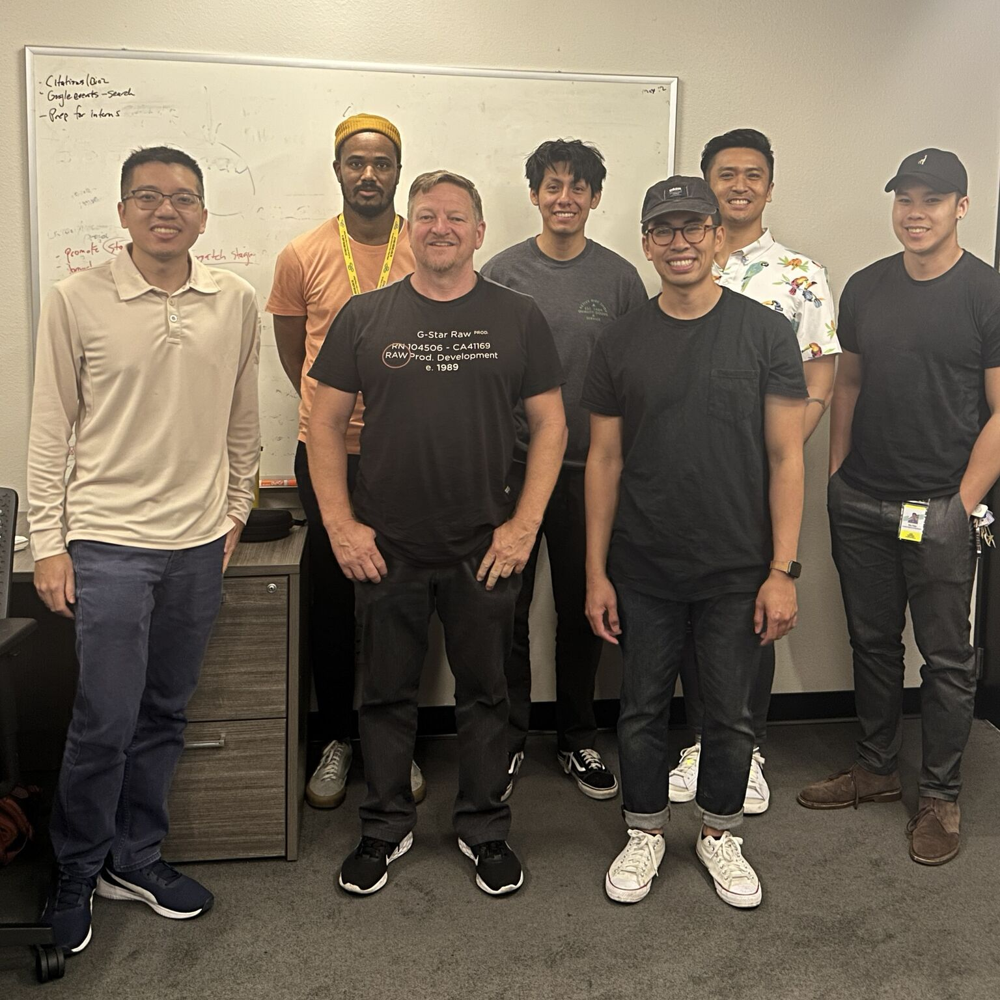

 

#### My name is John Nguyen, I am the Front-End Web Developer II at Zymo Research

 

 

 

##### My main responsibilities at work are:

- I am the glue guy. I make relationships and partnerships across different departments to offer our expertise in web technology to help accomplish their business strategies and meet goals.
- I manage a team of three junior developers and translate our stakeholders' goals and strategies into team initiatives and projects.
- I identify key areas to improve website performance and customer experience and steer the overall direction of our tech stack.
- I maintain our eCommerce platform.

 

 

##### At home, I work on hobby projects:

- I'm building my own personal website using Remix and Tailwind
- To increase my productity, I'm learning Vim and configuring my setup
- I'm learning a non-QWERTY keyboard layout

> If I could, I would code all day non-stop. There's so much for me to learn, and I want to learn it all! (yes, even including data structures and algorithms)

 

##### When I'm not coding:

- I want to learn how to be a mountaineer so I can go hike and camp in the snow up in the mountains
- Learning boxing, kickboxing
- I want to get back into the gym
- <strong><u>I love dancing</u></strong>
- Recovering plant addict
